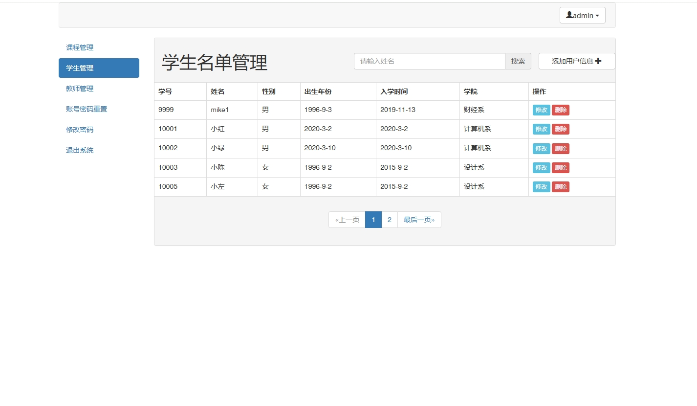

# 1.项目介绍
- 系统角色：管理员、教师、学生
- 功能模块：管理员（课程管理、教师管理、学生管理）、教师（课程管理）、学生（查看课程、已修课程、已选选课）
- 技术栈：SSM，JSP
- 测试环境：idea2024，tomcat8.5，MySQL5.7
# 2.项目部署
- 通过navicat创建数据库，并导入sql
- 通过idea打开项目
- 根据本地数据库环境修改resources/mysql.properties  1-4行
- 右键 WebContent/WEB-INF/lib ， 点击  add as lib ..
- 配置tomcat并启动
- 打开：http://本机IP:8080/  账号密码查看表。管理员账号密码：admin/123
- 教师账号密码：1001/123
- 学生账号密码：10003/123
# 3.项目部分截图

# 4.获取方式
[戳我查看](https://gitee.com/aven999/mall)